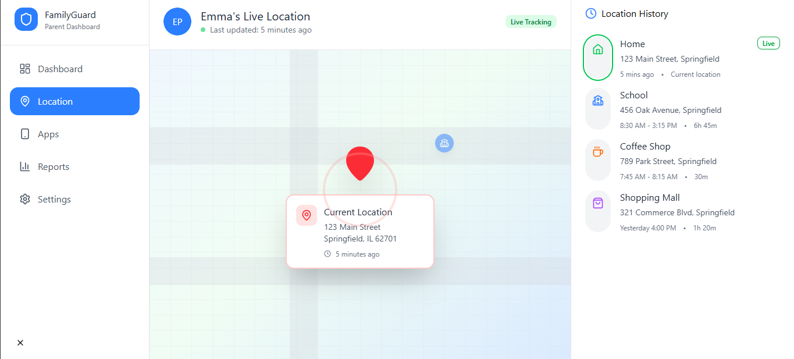

# FamilyGuard Parent Dashboard

[](https://codecov.io/github/zoulfiq4r/FamilyGuardWeb)


=======


> A production-ready React + Firebase dashboard that helps parents monitor device usage, location, and app health across their family.

## Overview

FamilyGuard is a parent-facing control center for the companion mobile app. It authenticates parents via Firebase, lets them pair a child device, then streams telemetry (screen time, installed apps, location traces) in near real time. The UI is designed for clarity and recruiter-friendly polish with Tailwind CSS, shadcn/Radix UI primitives, and data visualizations powered by Recharts and Leaflet.

## Screenshots




## Table of Contents

- [Key Features](#key-features)
- [Tech Stack](#tech-stack)
- [Architecture](#architecture)
- [Folder Structure](#folder-structure)
- [Realtime Data / Firestore Collections](#realtime-data--firestore-collections)
- [Firebase Services Used](#firebase-services-used)
- [Getting Started](#getting-started)
- [Environment Variables](#environment-variables)
- [Running & Testing](#running--testing)
- [Deployment](#deployment)
- [Troubleshooting](#troubleshooting)
- [Future Improvements](#future-improvements)
- [Contributing](#contributing)
- [License](#license)
- [Contact / Author](#contact--author)

## Key Features

- **Email/password parent authentication** powered by Firebase Auth plus Firestore-backed user profiles.
- **Child onboarding workflow** with pairing-code generation, real-time child listing, and enforced child selection before accessing sensitive dashboards.
- **Live telemetry dashboard** (`DashboardHome`) combining hourly usage, weekly trends, category breakdown, and top apps through the reusable `useChildTelemetry` hook.
- **App management center** for reviewing installed apps, toggling allow/block state, and pushing contextual block messages to Firestore.
- **Real-time location tracking** via Leaflet maps that merge embedded location objects and `children/{childId}/locations` history.
- **Reports, analytics, and settings shells** to showcase product breadth for recruiters and future contributors.
- **TypeScript-first design system** under `components/ui` (shadcn/Radix) for rapid feature development with consistent UX.

## Tech Stack

| Layer | Tools |
| --- | --- |
| Frontend | React 19 (CRA), TypeScript, Tailwind CSS, Radix UI/shadcn, clsx |
| Data Visualization | Recharts, embla carousel, Lucide icons |
| Maps & Geolocation | Leaflet, react-leaflet |
| State & Forms | React hooks, React Hook Form, custom telemetry hooks |
| Backend-as-a-Service | Firebase Authentication, Cloud Firestore |
| Testing | Jest, React Testing Library, @testing-library/user-event |

## Architecture

The dashboard follows a feature-module layout with shared Firebase utilities and hook-based data access.

```
React App (CRA + Tailwind + TS)
├─ Feature Shell (App.tsx)
│  ├─ AuthScreen → Firebase Auth (email/password)
│  ├─ ChildSelector → Firestore children collection
│  └─ DashboardLayout → orchestrates navigation + child context
├─ Feature Modules
│  ├─ DashboardHome → useChildTelemetry → Firestore:
│  │    • children/{childId}/usageHistory
│  │    • children/{childId}/currentApp
│  │    • appUsageAggregates/{childId}
│  ├─ LocationTracking → LiveLocationMap → Firestore:
│  │    • children/{childId}/locations + childDoc.currentLocation
│  ├─ AppManagement → children/{childId}/apps + appControls + families/{uid}
│  ├─ PairingCodeGenerator → pairingCodes collection
│  ├─ ReportsAnalytics / SettingsPage → productized shells
│  └─ Shared UI primitives (components/ui)
└─ Firebase Config (src/config/firebase.ts)
   ├─ initializeApp + getAuth + getFirestore
   └─ Helpers (createPairingCode)
```

## Folder Structure

```
parent-dashboard/
├── public/                 # CRA static assets
├── src/
│   ├── components/         # Feature modules & smart components
│   │   ├── ui/             # shadcn / Radix-derived primitives
│   │   ├── LiveLocationMap # Leaflet map + utilities
│   │   └── *.test.tsx      # RTL unit tests per component
│   ├── hooks/              # Reusable Firestore listeners (useChildTelemetry, etc.)
│   ├── config/             # Firebase initialization + helpers
│   ├── test/               # Jest mocks for static assets/styles
│   ├── App.tsx             # Feature router + auth guard
│   └── index.tsx           # CRA entry point
├── tailwind.config.js      # Tailwind theme + content paths
├── postcss.config.js       # Tailwind/PostCSS pipeline
├── package.json            # Scripts and dependencies
├── tsconfig.json           # TypeScript compiler options
└── README.md               # You are here
```

- **`components/`** groups each product surface (Auth, Dashboard, AppManagement, Location, Reports, Settings, Pairing, ChildSelector).
- **`components/ui/`** centralizes buttons, cards, tabs, tables, and other primitives for highly consistent UI.
- **`hooks/useChildTelemetry.ts`** normalizes Firestore snapshots, merges hourly history, aggregates, and live app info.
- **`config/firebase.ts`** initializes Firebase and exposes helpers (auth, db, pairing code creator).
- **`test/`** hosts Jest mocks for CSS and static assets so React Testing Library works without bundler context.

## Realtime Data / Firestore Collections

Although there is no custom REST API, the app consumes Firestore collections as its real-time backend:

| Collection / Doc | Purpose | Key Fields |
| --- | --- | --- |
| `users` | Parent profile created after registration | `userId`, `parentName`, `role`, `createdAt` |
| `pairingCodes` | Temporary codes to bind a child device | `code`, `parentId`, `childName`, `isUsed`, `createdAt` |
| `children` | Child profile docs (parent link, metadata, embedded location/app data) | `parentId`, `name`, `currentApp`, `currentLocation`, etc. |
| `children/{childId}/apps` | Installed apps & usage telemetry per child | `name`, `packageName`, `usageMinutes`, `isBlocked`, `category` |
| `children/{childId}/appControls` & `families/{parentId}/children/{childId}/appControls` | Allow/block overrides and block messages | `isBlocked`, `blockMessage`, `updatedAt` |
| `children/{childId}/currentApp` | Real-time stream of the current running app | `name`, `packageName`, `startedAt`, `lastUpdated` |
| `children/{childId}/usageHistory` | Daily aggregates used by DashboardHome | `date`, `totalMinutes`, `hourly` array |
| `appUsageAggregates/{childId}` | Weekly/category rollups for charts | `totalMinutes`, `categoryTotals`, `topApps`, `updatedAt` |
| `children/{childId}/locations` | GPS points plotted on the Leaflet map | `latitude`, `longitude`, `accuracy`, `timestamp`, metadata |

## Firebase Services Used

- **Authentication (Email & Password)** – `AuthScreen` handles registration and login flows.
- **Cloud Firestore** – Real-time listeners for every feature (children, telemetry, app controls, pairing codes).
- *(Planned)* **Security Rules / Cloud Functions** – add invariants such as pairing-code expiry or fan-out updates.

## Getting Started

### Prerequisites

- Node.js **18+** and npm **9+** (matches React 19 + CRA requirements).
- Firebase project with Authentication and Cloud Firestore enabled.
- Optional: A `docs/screenshots` directory for marketing assets.

### Installation

```bash
git clone https://github.com/<your-org>/parent-dashboard.git
cd parent-dashboard
npm install
```

## Environment Variables

Move the Firebase secrets out of `src/config/firebase.ts` and into a `.env.local` file. CRA automatically loads variables prefixed with `REACT_APP_`.

```bash
cp .env.example .env.local   # create this file if it doesn't exist yet
```

`.env.example`

```
REACT_APP_FIREBASE_API_KEY=
REACT_APP_FIREBASE_AUTH_DOMAIN=
REACT_APP_FIREBASE_PROJECT_ID=
REACT_APP_FIREBASE_STORAGE_BUCKET=
REACT_APP_FIREBASE_MESSAGING_SENDER_ID=
REACT_APP_FIREBASE_APP_ID=
REACT_APP_FIREBASE_MEASUREMENT_ID=
```

Update `src/config/firebase.ts` to read from these variables before committing.

## Running & Testing

| Command | Description |
| --- | --- |
| `npm start` | Runs the CRA dev server at `http://localhost:3000` with live reload. |
| `npm test` | Launches Jest/RTL in watch mode. |
| `npm run build` | Produces an optimized production bundle in `/build`. |
| `npm run eject` | CRA escape hatch (irreversible). |

To run tests in CI or generate coverage locally:

```bash
npm test -- --coverage
```

## Deployment

1. Configure `REACT_APP_*` Firebase variables in your hosting provider (Netlify, Vercel, Render, Firebase Hosting, etc.).
2. Run `npm run build`.
3. Deploy the contents of the `build/` directory.
4. Ensure Firebase Auth authorized domains include your production hostname.
5. Review Firestore security rules before inviting real users.

## Troubleshooting

- **No children appear after pairing:** Confirm the mobile app creates a document in `children` with the `parentId` that matches the authenticated parent UID. Logs are printed in `ChildSelector`.
- **App list stays empty:** Device must push documents to `children/{childId}/apps`. Watch browser console logs from `AppManagement` to validate Firestore paths.
- **Location map is blank:** Ensure the device writes to `children/{childId}/locations` _or_ embeds `currentLocation` on the child doc with `latitude`, `longitude`, `timestamp`.
- **Auth errors in development:** Double-check that the Firebase config matches your project and that the domain (localhost) is authorized under Firebase Auth.
- **Styling looks off:** Tailwind relies on PostCSS + CRA. Restart `npm start` after editing `tailwind.config.js`.

## Future Improvements

1. Replace static analytics data in `ReportsAnalytics` and `SettingsPage` with live Firestore data.
2. Move Firebase credentials into environment variables and add `.env.example` to version control.
3. Harden Firestore security rules and add Cloud Functions to expire pairing codes + normalize telemetry.
4. Add integration/e2e tests (Playwright/Cypress) to validate pairing, app management, and map workflows.
5. Provide CI/CD pipelines (GitHub Actions) for linting, testing, and deploying the dashboard automatically.
6. Package the shared `components/ui` primitives as a local library for reuse in companion apps.

## Contributing

Contributions are welcome! Please open an issue or pull request with a clear description of the enhancement or bug fix. Keep PRs focused, include relevant screenshots/gifs when changing UI, and add tests when possible.

## License

Distributed under the **MIT License**. See `LICENSE` (add one if it does not exist yet) for more information.

## Contact / Author

**Zoulfiqar** — [@zoulfiq4r](https://github.com/zoulfiq4r)

Feel free to reach out for collaborations, product questions, or recruiter inquiries.
>>>>>>> b4ef148 ( hello world)
